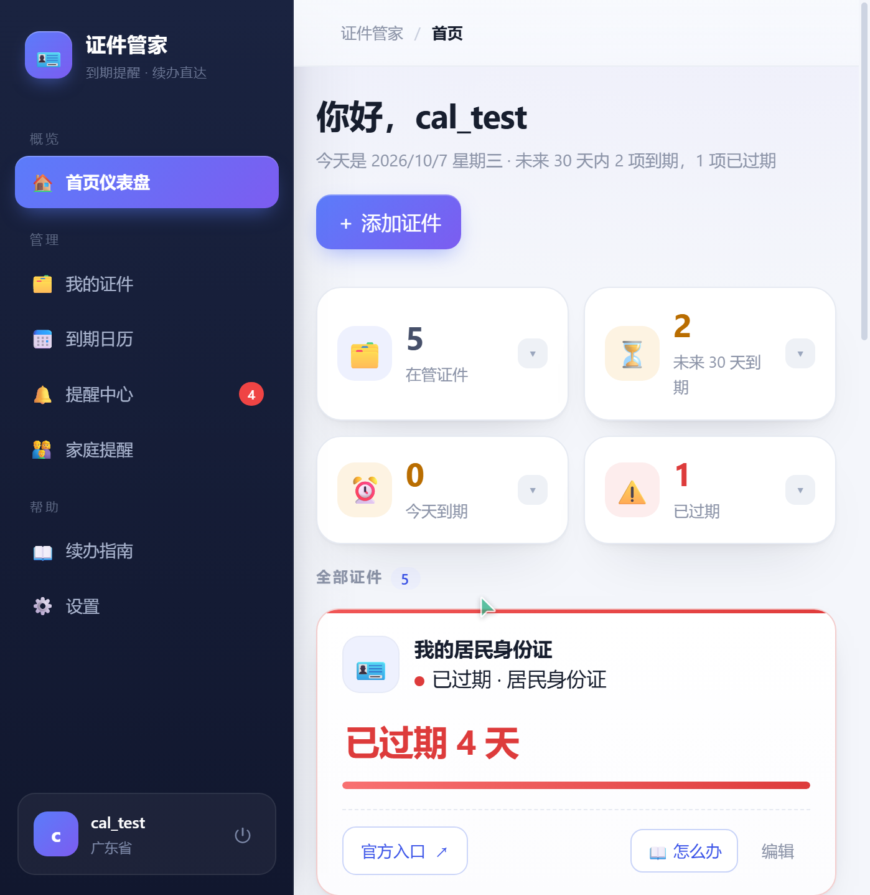
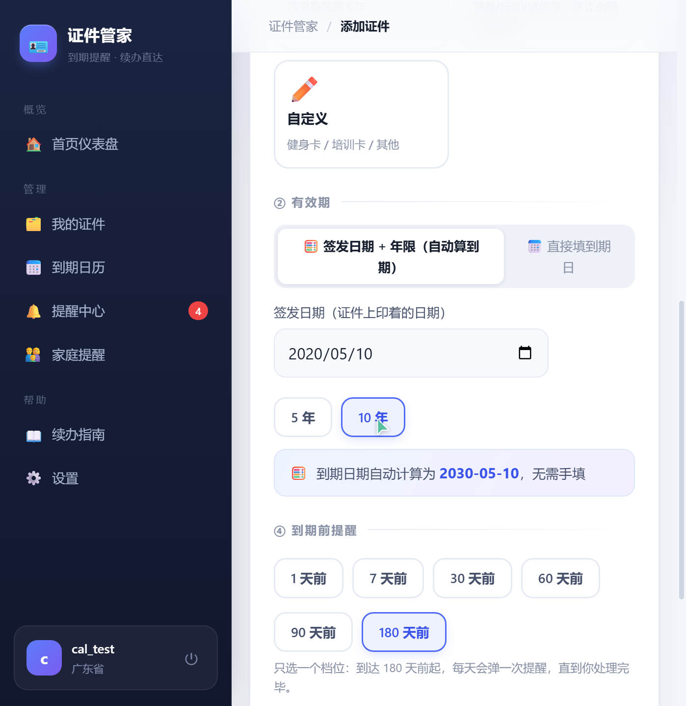

# 证件管家 · 界面展示

> 证件到期提醒与续办管理平台。签发日期 + 年限自动算到期，90/30/7 天分级提醒引擎，全国 31 省级行政区官方续办指南。以下均为系统真实运行截图。

**技术栈**：Vue 3 · FastAPI · MySQL 8 · Redis · AES-256-GCM 加密

## 界面总览

## 分页截图

### 1. 首页仪表盘 · 到期统计与过期预警

### 2. 添加证件 · 到期日自动计算

### 3. 我的证件 · 智能筛选

### 4. 续办日历

### 5. 提醒中心 · 90/30/7 天分级提醒

### 6. 全国续办办理指南

