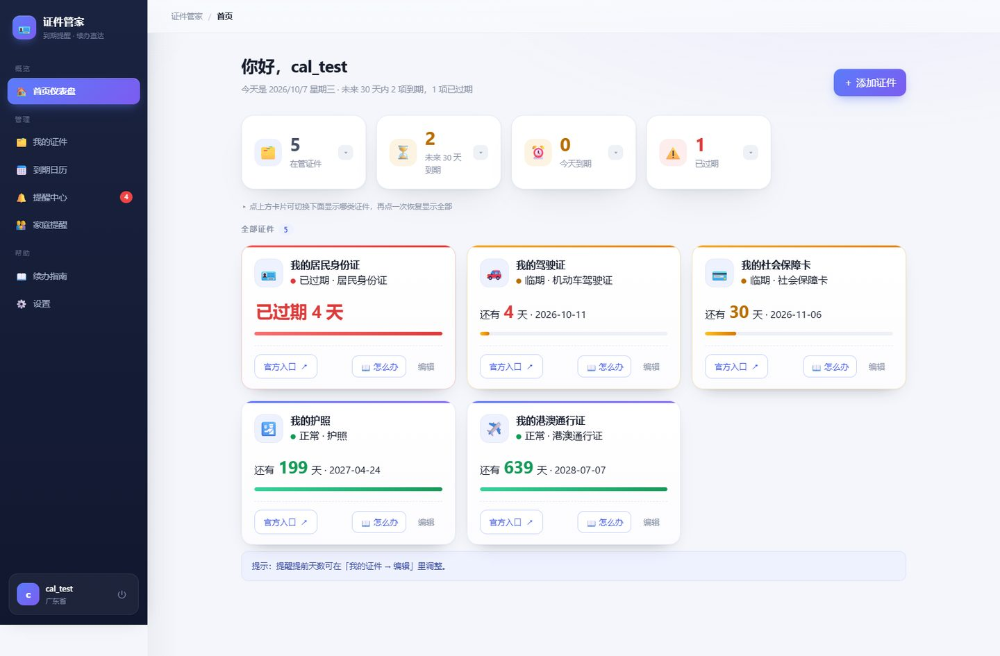
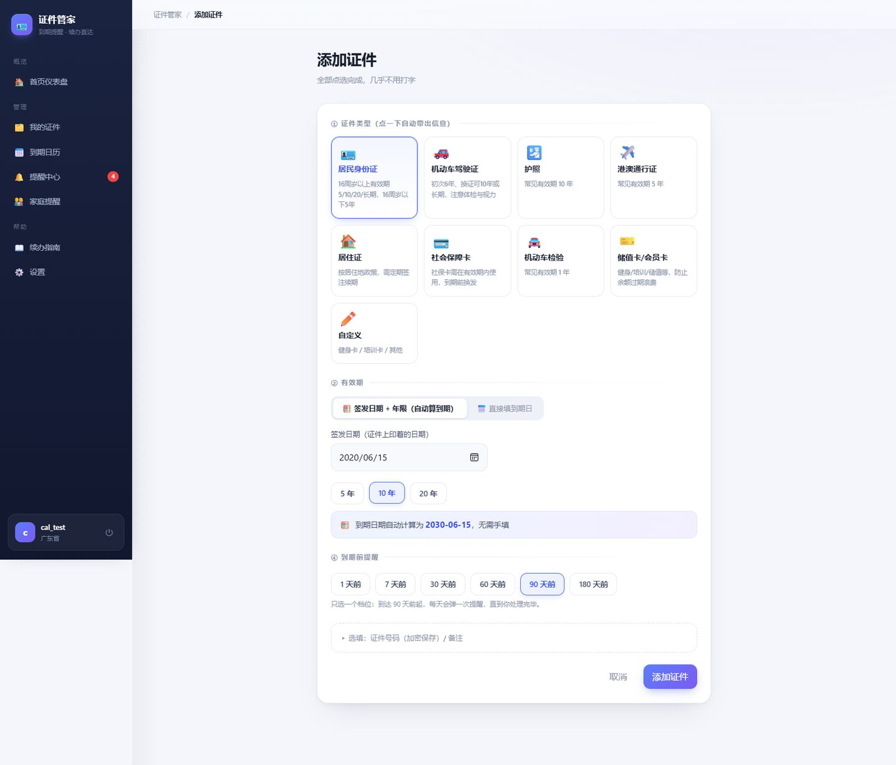
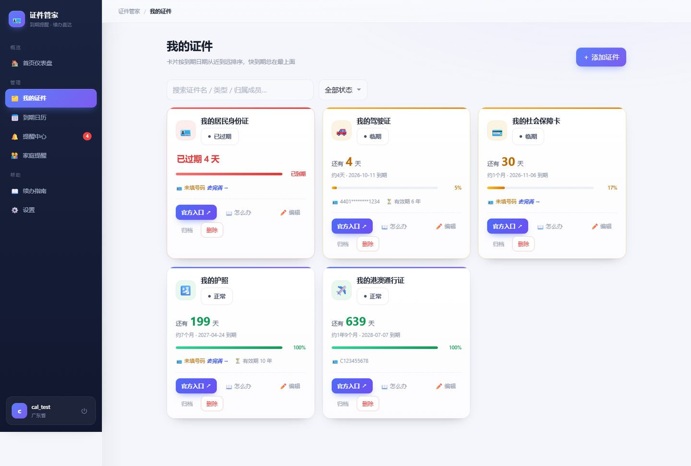
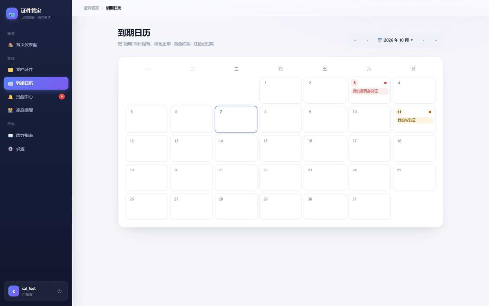
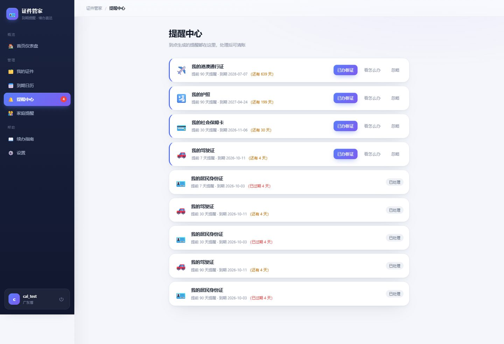
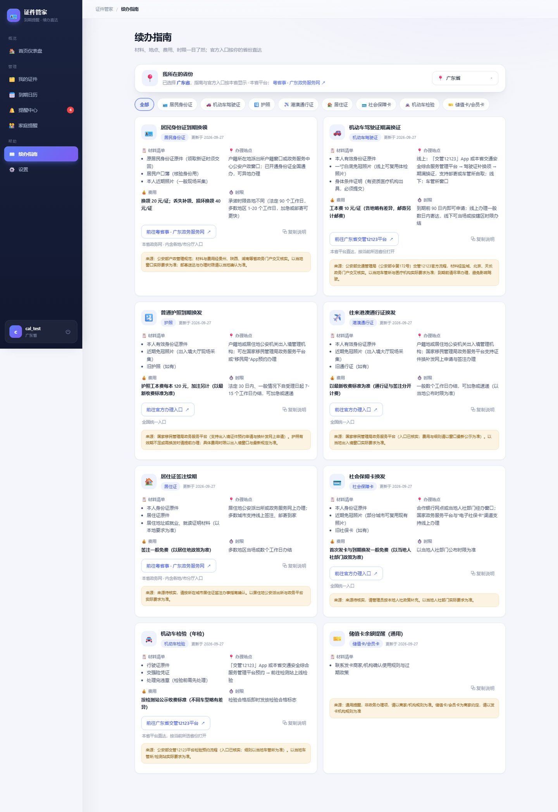
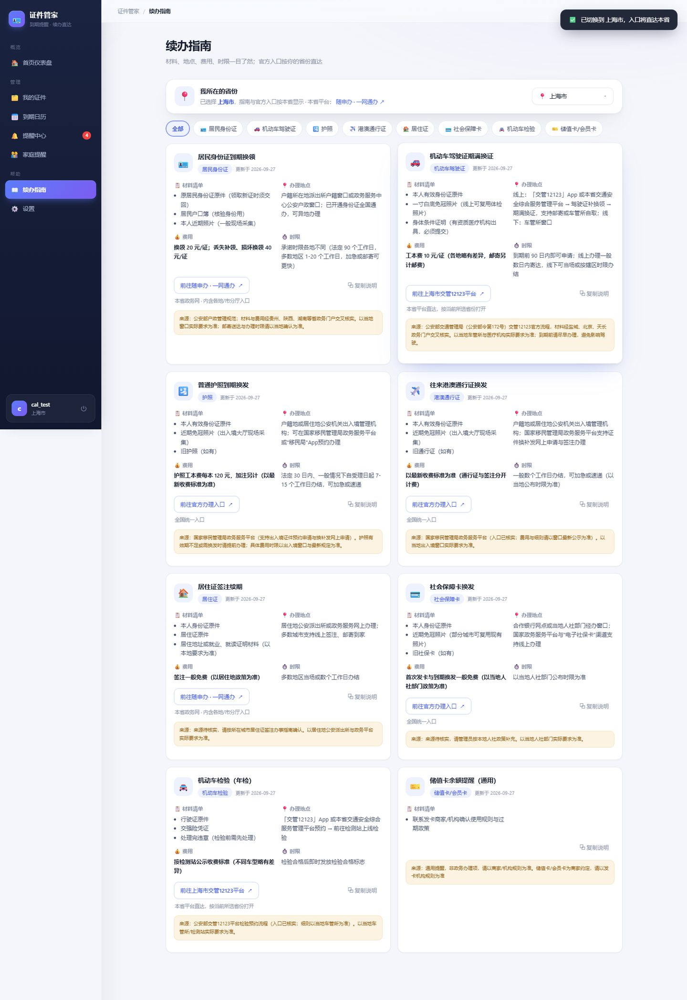

# 证件管家 · 界面展示

> 证件到期提醒与续办管理平台。签发日期 + 年限自动算到期，90/30/7 天分级提醒引擎，全国 31 省级行政区（含港澳台）官方续办指南，切换省份后入口直达本省政务平台。以下均为系统真实运行截图。

**技术栈**：Vue 3 · FastAPI · MySQL 8 · Redis · AES-256-GCM 加密

## 分页截图

### 1. 首页仪表盘 · 到期统计与过期预警

### 2. 添加证件 · 到期日自动计算

### 3. 我的证件 · 智能筛选

### 4. 到期日历

### 5. 提醒中心 · 90/30/7 天分级提醒

### 6. 续办指南 · 省份直达（广东）

内置全国 31 个省级行政区（含港澳台）的官方续办入口，按所选省份直达本省政务平台。

### 7. 续办指南 · 切换上海（官方入口对比）

切换省份后，办理入口自动切换为本省官方平台：广东显示「广东政务服务网 / 广东省交管 12123」，上海显示「随申办一网通办 / 上海市交管 12123」。

